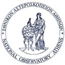
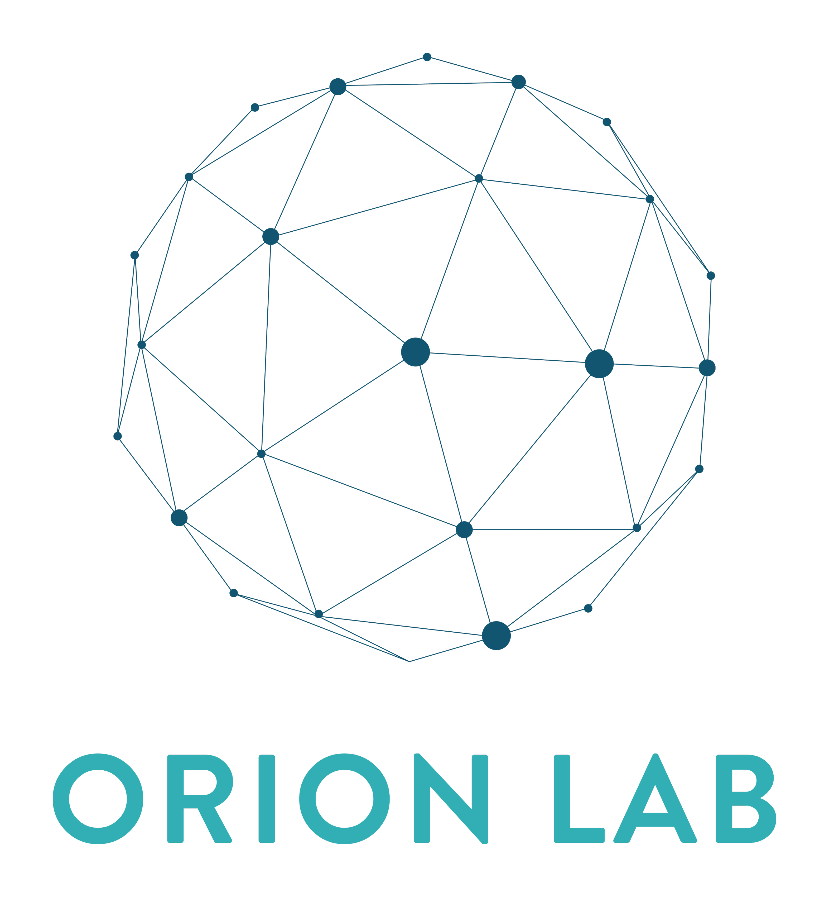

  
  

## AI Science Cafe

Organised by Orion Lab (NOA).

This is a series of presentations made by members of the Institute for Astronomy, Astrophysics, Space Applications and Remote Sensing (IAASARS) at NOA.

Topics are centered around the application of Deep Learning techniques on Remote Sensing tasks and participants are expected to present and explain a published paper of their choice in ~20min.
